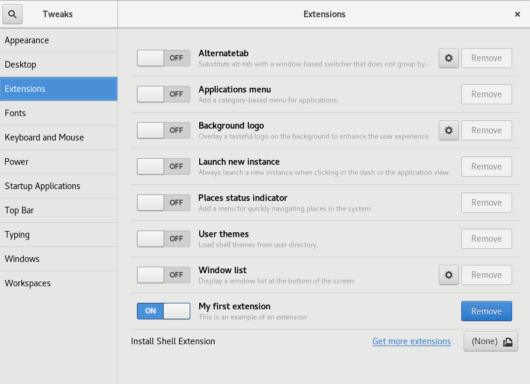
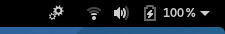
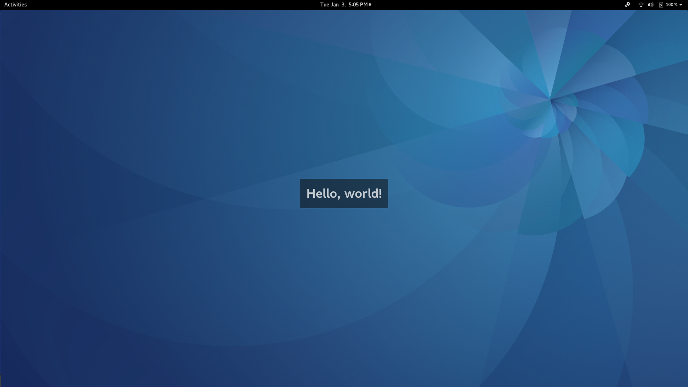

# TUTORIAL

## My First extension
Finally! Now, we do our first simple extension, a simple hello world. For do that, we use a gnome tool for do extensions called "gnome-shell-extension-tool". Then, to start your first extension put this in a terminal: 

```bash
gnome-shell-extension-tool --create-extension
```


Then you are asked about the name of your application. For this extension we put in `my first extension` and press enter.

Then you are asked about a description. Put something like: `this is an example of an extension`

Then you are asked about an UUID. In that case, we write `first-extension@yourname.com` and press enter.

Tada! The code of the main file is shown in gedit. 

Now [enable](GETTING-STARTED.md#enabling-extensions) your extension. Now, do you see in the system tray a new icon with a gears shape? Click it and you can see how your extension tells you "Hello, world!".
Analyze this visually. You see an icon in the system tray. Also, when you click it, you see a label and this label has an animation (from opacity 100% to opacity 0%). Now, we'll see in the code how it is defined.


> Tweak tool


> Gears icon in the top menu right corner




To see the code of your extension and edit it you have to know where is it. It is in `~/.local/share/gnome-shell/extensions/` and there are all extensions, including your new extension `first-extension@yourname.com` folder. Go to your extension folder, and you'll see a `extension.js`, a `metadata.json` and a `stylesheet.css`

 