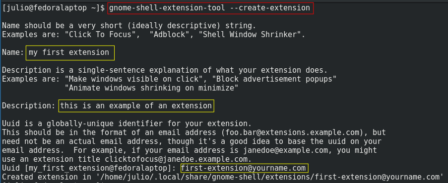

# TUTORIAL

##My First extension
Finally! Now, we do our first simple extension, a simple hello world. For do that, we use a gnome tool for do extensions called "gnome-shell-extension-tool". Then, to start your first extension put this in a terminal: 

```bash
gnome-shell-extension-tool --create-extension
```



Then you are asked about the name of your application. For this extension we put in `my first extension` and press enter.

Then you are asked about a description. Put something like: `this is an example of an extension`

Then you are asked about an UUID. In that case, we write `first-extension@yourname.com` and press enter.

Tada! The code of the main file is shown in gedit. 